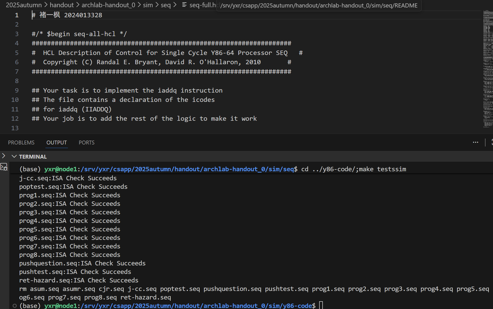

# CSAPP:Archlab 实验报告

## 实验环境

- 操作系统：Windows 11 25H2 + WSL 2.3.26 + Ubuntu 24.04.1 LTS
- 文件目录：通过 /mnt/c 访问 Windows 文件系统

**注：实验过程中出现了环境问题，导致 y86-code test 无法正常运行。咨询助教后，发现代码在助教的环境中可通过测试，说明代码本身没有问题。因此，y86-code test 部分的运行结果截图由助教提供。**

## Level 1

### 1.1 sum.ys

#### 1.1.1 C++ 源代码

```cpp
/* sum_list - Sum the elements of a linked list */
long sum_list(list_ptr ls)
{
    long val = 0;
    while (ls) {
	val += ls->val;
	ls = ls->next;
    }
    return val;
}
```

#### 1.1.2 Y86-64 汇编代码

```assembly
init:
    irmovq Stack, %rsp
    call Main
    halt

# Sample linked list
.align 8
ele1:
    .quad 0x00a
    .quad ele2
ele2:
    .quad 0x0b0
    .quad ele3
ele3:
    .quad 0xc00
    .quad 0

Main:
    irmovq ele1, %rdi
    call sum
    ret

sum:                            # long sum_list(list_ptr ls)
    irmovq $0, %rax             # long val = 0;
    andq %rdi, %rdi             
    je exit
loop:                           # while (ls)
    mrmovq 0(%rdi), %rcx        
    addq %rcx, %rax             # val += ls->val;
    mrmovq 8(%rdi), %rdi        # ls = ls->next;
    andq %rdi, %rdi             
    jne loop
exit:
    ret

.pos 0x100
Stack:

```

#### 1.1.3 实验结果

```text
(base) sqzr2319@sqzr2319:/mnt/c/Files/GitHub/Courses/THSS-25Fall-CSAPP/archlab/sim/misc$ ./yis sum.yo
Stopped in 25 steps at PC = 0x13.  Status 'HLT', CC Z=1 S=0 O=0
Changes to registers:
%rax:   0x0000000000000000      0x0000000000000cba
%rcx:   0x0000000000000000      0x0000000000000c00
%rsp:   0x0000000000000000      0x0000000000000100

Changes to memory:
0x00f0: 0x0000000000000000      0x000000000000005b
0x00f8: 0x0000000000000000      0x0000000000000013
```

### 1.2 rsum.ys

#### 1.2.1 C++ 源代码

```cpp
/* rsum_list - Recursive version of sum_list */
long rsum_list(list_ptr ls)
{
    if (!ls)
	return 0;
    else {
	long val = ls->val;
	long rest = rsum_list(ls->next);
	return val + rest;
    }
}
```

#### 1.2.2 Y86-64 汇编代码

```assembly
init:
    irmovq Stack, %rsp
    call Main
    halt

# Sample linked list
.align 8
ele1:
    .quad 0x00a
    .quad ele2
ele2:
    .quad 0x0b0
    .quad ele3
ele3:
    .quad 0xc00
    .quad 0

Main:
    irmovq ele1, %rdi
    call rsum
    ret

rsum:                           # long rsum_list(list_ptr ls)
    irmovq $0, %rax             # long val = 0;
    andq %rdi, %rdi             # if (!ls)
    je exit
    pushq %rbx
    mrmovq 0(%rdi), %rbx        # val = ls->value;
    mrmovq 8(%rdi), %rdi        
    call rsum                   # long rest = rsum_list(ls->next);
    addq %rbx, %rax             # return val + rest;
    popq %rbx
exit:
    ret

.pos 0x100
Stack:

```

#### 1.2.3 实验结果

```text
(base) sqzr2319@sqzr2319:/mnt/c/Files/GitHub/Courses/THSS-25Fall-CSAPP/archlab/sim/misc$ ./yis rsum.yo
Stopped in 40 steps at PC = 0x13.  Status 'HLT', CC Z=0 S=0 O=0
Changes to registers:
%rax:   0x0000000000000000      0x0000000000000cba
%rsp:   0x0000000000000000      0x0000000000000100

Changes to memory:
0x00c0: 0x0000000000000000      0x0000000000000090
0x00c8: 0x0000000000000000      0x00000000000000b0
0x00d0: 0x0000000000000000      0x0000000000000090
0x00d8: 0x0000000000000000      0x000000000000000a
0x00e0: 0x0000000000000000      0x0000000000000090
0x00f0: 0x0000000000000000      0x000000000000005b
0x00f8: 0x0000000000000000      0x0000000000000013
```

### 1.3 copy.ys

#### 1.3.1 C++ 源代码

```cpp
/* copy_block - Copy src to dest and return xor checksum of src */
long copy_block(long *src, long *dest, long len)
{
    long result = 0;
    while (len > 0) {
	long val = *src++;
	*dest++ = val;
	result ^= val;
	len--;
    }
    return result;
}
```

#### 1.3.2 Y86-64 汇编代码

```assembly
init:
    irmovq Stack, %rsp
    call Main
    halt

.align 8
# Source block
src:
    .quad 0x00a
    .quad 0x0b0
    .quad 0xc00
# Destination block
dest:
    .quad 0x111
    .quad 0x222
    .quad 0x333

Main:
    irmovq src, %rdi
    irmovq dest, %rsi
    irmovq $3, %rdx
    call copy
    ret

copy:                       # long copy_block(long *src, long *dest, long len)
    irmovq $0, %rax         # long result = 0;
    irmovq $8, %r8
    irmovq $1, %r9
    andq %rdx, %rdx
    je exit
loop:                       # while (len > 0)
    mrmovq 0(%rdi), %rcx    
    addq %r8, %rdi          # long val = *src++;
    rmmovq %rcx, 0(%rsi)
    addq %r8, %rsi          # *dest++ = val;
    xorq %rcx, %rax         # result ^= val;
    subq %r9, %rdx          # len--;
    jne loop
exit:
    ret

.pos 0x100
Stack:

```

#### 1.3.3 实验结果

```text
(base) sqzr2319@sqzr2319:/mnt/c/Files/GitHub/Courses/THSS-25Fall-CSAPP/archlab/sim/misc$ ./yis copy.yo
Stopped in 35 steps at PC = 0x13.  Status 'HLT', CC Z=1 S=0 O=0
Changes to registers:
%rax:   0x0000000000000000      0x0000000000000cba
%rcx:   0x0000000000000000      0x0000000000000c00
%rsp:   0x0000000000000000      0x0000000000000100
%rsi:   0x0000000000000000      0x0000000000000048
%rdi:   0x0000000000000000      0x0000000000000030
%r8:    0x0000000000000000      0x0000000000000008
%r9:    0x0000000000000000      0x0000000000000001

Changes to memory:
0x0030: 0x0000000000000111      0x000000000000000a
0x0038: 0x0000000000000222      0x00000000000000b0
0x0040: 0x0000000000000333      0x0000000000000c00
0x00f0: 0x0000000000000000      0x000000000000006f
0x00f8: 0x0000000000000000      0x0000000000000013
```

## Level 2

### 2.1 seq-full.hcl 修改说明

#### 2.1.1 iaddq 实现

```text
Stage		iaddq rB,V
Fetch		icode:ifun <- M1[PC]
			rA:rB <- M1[PC+1]
			valC <- M8[PC+2]
			valP <- PC+10
Decode		valB <- R[rB]
Execute		valE <- valC + valB
Memory		(no action)
Write Back	R[rB] <- valE
PC Update	PC <- valP
```

#### 2.1.2 修改位置

```text
bool instr_valid = icode in 
	{ INOP, IHALT, IRRMOVQ, IIRMOVQ, IRMMOVQ, IMRMOVQ,
	       IOPQ, IJXX, ICALL, IRET, IPUSHQ, IPOPQ, IIADDQ };

# Does fetched instruction require a regid byte?
bool need_regids =
	icode in { IRRMOVQ, IOPQ, IPUSHQ, IPOPQ, 
		     IIRMOVQ, IRMMOVQ, IMRMOVQ, IIADDQ };

# Does fetched instruction require a constant word?
bool need_valC =
	icode in { IIRMOVQ, IRMMOVQ, IMRMOVQ, IJXX, ICALL, IIADDQ };

## What register should be used as the B source?
word srcB = [
	icode in { IOPQ, IRMMOVQ, IMRMOVQ, IIADDQ } : rB;
	icode in { IPUSHQ, IPOPQ, ICALL, IRET } : RRSP;
	1 : RNONE;  # Don't need register
];

## What register should be used as the E destination?
word dstE = [
	icode in { IRRMOVQ } && Cnd : rB;
	icode in { IIRMOVQ, IOPQ} : rB;
	icode in { IPUSHQ, IPOPQ, ICALL, IRET } : RRSP;
	icode in { IIADDQ } : rB;
	1 : RNONE;  # Don't write any register
];

## Select input A to ALU
word aluA = [
	icode in { IRRMOVQ, IOPQ } : valA;
	icode in { IIRMOVQ, IRMMOVQ, IMRMOVQ, IIADDQ } : valC;
	icode in { ICALL, IPUSHQ } : -8;
	icode in { IRET, IPOPQ } : 8;
	# Other instructions don't need ALU
];

## Select input B to ALU
word aluB = [
	icode in { IRMMOVQ, IMRMOVQ, IOPQ, ICALL, 
		      IPUSHQ, IRET, IPOPQ, IIADDQ } : valB;
	icode in { IRRMOVQ, IIRMOVQ } : 0;
	# Other instructions don't need ALU
];

## Should the condition codes be updated?
bool set_cc = icode in { IOPQ, IIADDQ };
```

### 2.2 实验结果

#### 2.2.1 y86-code test（截图由助教提供）



#### 2.2.2 ptest

测试所有指令是否正常：

```text
(base) sqzr2319@sqzr2319:/mnt/c/Files/GitHub/Courses/THSS-25Fall-CSAPP/archlab/sim/seq$ (cd ../ptest; make SIM=../seq/ssim)
./optest.pl -s ../seq/ssim 
Simulating with ../seq/ssim
  All 49 ISA Checks Succeed
./jtest.pl -s ../seq/ssim 
Simulating with ../seq/ssim
  All 64 ISA Checks Succeed
./ctest.pl -s ../seq/ssim 
Simulating with ../seq/ssim
  All 22 ISA Checks Succeed
./htest.pl -s ../seq/ssim 
Simulating with ../seq/ssim
  All 600 ISA Checks Succeed
```

测试 iaddq：

```
(base) sqzr2319@sqzr2319:/mnt/c/Files/GitHub/Courses/THSS-25Fall-CSAPP/archlab/sim/seq$ (cd ../ptest; make SIM=../seq/ssim TFLAGS=-i)
./optest.pl -s ../seq/ssim -i
Simulating with ../seq/ssim
  All 58 ISA Checks Succeed
./jtest.pl -s ../seq/ssim -i
Simulating with ../seq/ssim
  All 96 ISA Checks Succeed
./ctest.pl -s ../seq/ssim -i
Simulating with ../seq/ssim
  All 22 ISA Checks Succeed
./htest.pl -s ../seq/ssim -i
Simulating with ../seq/ssim
  All 756 ISA Checks Succeed
```

## Level 3

### 3.1 pipe-full.hcl 修改说明

#### 3.1.1 iaddq 实现

```text
Stage		iaddq rB,V
Fetch		icode:ifun <- M1[PC]
			rA:rB <- M1[PC+1]
			valC <- M8[PC+2]
			PC <- PC+10
Decode		valB <- R[rB]
Execute		valE <- valC + valB
Memory		(no action)
Write Back	R[rB] <- valE
```

#### 3.1.2 修改位置

```test
# Is instruction valid?
bool instr_valid = f_icode in 
	{ INOP, IHALT, IRRMOVQ, IIRMOVQ, IRMMOVQ, IMRMOVQ,
	  IOPQ, IJXX, ICALL, IRET, IPUSHQ, IPOPQ, IIADDQ };

# Does fetched instruction require a regid byte?
bool need_regids =
	f_icode in { IRRMOVQ, IOPQ, IPUSHQ, IPOPQ, 
		     IIRMOVQ, IRMMOVQ, IMRMOVQ, IIADDQ };

# Does fetched instruction require a constant word?
bool need_valC =
	f_icode in { IIRMOVQ, IRMMOVQ, IMRMOVQ, IJXX, ICALL, IIADDQ };

## What register should be used as the B source?
word d_srcB = [
	D_icode in { IOPQ, IRMMOVQ, IMRMOVQ, IIADDQ } : D_rB;
	D_icode in { IPUSHQ, IPOPQ, ICALL, IRET } : RRSP;
	1 : RNONE;  # Don't need register
];

## What register should be used as the E destination?
word d_dstE = [
	D_icode in { IRRMOVQ, IIRMOVQ, IOPQ, IIADDQ } : D_rB;
	D_icode in { IPUSHQ, IPOPQ, ICALL, IRET } : RRSP;
	1 : RNONE;  # Don't write any register
];

## Select input A to ALU
word aluA = [
	E_icode in { IRRMOVQ, IOPQ } : E_valA;
	E_icode in { IIRMOVQ, IRMMOVQ, IMRMOVQ, IIADDQ } : E_valC;
	E_icode in { ICALL, IPUSHQ } : -8;
	E_icode in { IRET, IPOPQ } : 8;
	# Other instructions don't need ALU
];

## Select input B to ALU
word aluB = [
	E_icode in { IRMMOVQ, IMRMOVQ, IOPQ, ICALL, 
		     IPUSHQ, IRET, IPOPQ, IIADDQ } : E_valB;
	E_icode in { IRRMOVQ, IIRMOVQ } : 0;
	# Other instructions don't need ALU
];

## Should the condition codes be updated?
bool set_cc = E_icode in { IOPQ, IIADDQ } &&
	# State changes only during normal operation
	!m_stat in { SADR, SINS, SHLT } && !W_stat in { SADR, SINS, SHLT };
```

### 3.2 ncopy.ys 修改说明

#### 3.2.1 C++ 源代码

```cpp
/* $begin ncopy */
/*
 * ncopy - copy src to dst, returning number of positive ints
 * contained in src array.
 */
word_t ncopy(word_t *src, word_t *dst, word_t len)
{
    word_t count = 0;
    word_t val;

    while (len > 0) {
	val = *src++;
	*dst++ = val;
	if (val > 0)
	    count++;
	len--;
    }
    return count;
}
/* $end ncopy */
```

#### 3.2.2 Y86-64 基线汇编代码

```assembly
    # Loop header
    xorq %rax,%rax          # count = 0;
    andq %rdx,%rdx          # len <= 0?
    jle Done                # if so, goto Done:

Loop: 
    mrmovq (%rdi), %r10     # read val from src...
    rmmovq %r10, (%rsi)     # ...and store it to dst
    andq %r10, %r10         # val <= 0?
    jle Npos                # if so, goto Npos:
    irmovq $1, %r10
    addq %r10, %rax         # count++
Npos: 
    irmovq $1, %r10
    subq %r10, %rdx         # len--
    irmovq $8, %r10
    addq %r10, %rdi         # src++
    addq %r10, %rsi         # dst++
    andq %rdx,%rdx          # len > 0?
    jg Loop                 # if so, goto Loop:
```

#### 3.2.3 优化思路

第一步：借用新增指令 iaddq，修改基线代码。修改后 CPE 从 15.18 下降至 12.70。

第二步：细节修改，修改后 CPE 从 12.70 下降至 10.47。具体包括：
1. 注意到 `%rax` 初始值为 0，因此可以省略初始化语句 `xorq %rax,%rax`。
2. 注意到 `mrmovq` 和 `rmmovq` 连用触发了 Load/Use Hazard，可插入一条不使用 `r10` 的指令。
3. 注意到 `jle Done` 预测成功当且仅当 `len==0`，预测正确率过低，可改为 `jg Loop`。

第三步：循环展开，修改后 CPE 从 10.47 下降至 8.0 左右。具体包括：
1. 大循环：经过多次尝试，最终采用九路展开。
2. `len<9` 时的小循环：采用三路展开。
3. `len==1` 或 `len==2` 直接处理，不进入循环。

第四步：分支优化，利用 `jl`,`je`,`jg` 构建三叉树，并调整优先度。经过多次测试，最终选取的分支结构见 3.2.4 一节。修改后 CPE 从 8.0 左右下降至 7.63。

若对 `len<9` 的情况采取更细致的分支结构，CPE 还可能进一步下降至 7.50 以下，但考虑到调试工作量太大，最终未采用该思路。

#### 3.2.4 最终版优化代码

```assembly
	# Loop header
    iaddq $-9, %rdx
    jge Loop9
	iaddq $7, %rdx
	jg Loop3
	jl Loop
	je Loop2

Loop9:                          # 大循环：九路循环展开
    mrmovq   (%rdi), %r10
    mrmovq  8(%rdi), %r11
    mrmovq 16(%rdi), %r12
    mrmovq 24(%rdi), %r13
	mrmovq 32(%rdi), %r14
	mrmovq 40(%rdi), %r8
	mrmovq 48(%rdi), %r9
	mrmovq 56(%rdi), %rcx
	mrmovq 64(%rdi), %rbx
    rmmovq %r10,   (%rsi)
    rmmovq %r11,  8(%rsi)
    rmmovq %r12, 16(%rsi)
    rmmovq %r13, 24(%rsi)
	rmmovq %r14, 32(%rsi)
	rmmovq  %r8, 40(%rsi)
	rmmovq  %r9, 48(%rsi)
	rmmovq %rcx, 56(%rsi)
	rmmovq %rbx, 64(%rsi)
    andq %r10, %r10
    jle Npos0
    iaddq $1, %rax
Npos0:
    andq %r11, %r11
    jle Npos1
    iaddq $1, %rax
Npos1:
    andq %r12, %r12
    jle Npos2
    iaddq $1, %rax
Npos2:
    andq %r13, %r13
    jle Npos3
    iaddq $1, %rax
Npos3:
    andq %r14, %r14
    jle Npos4
    iaddq $1, %rax
Npos4:
	andq  %r8,  %r8
	jle Npos5
	iaddq $1, %rax
Npos5:
	andq  %r9,  %r9
	jle Npos6
	iaddq $1, %rax
Npos6:
	andq %rcx, %rcx
	jle Npos7
	iaddq $1, %rax
Npos7:
	andq %rbx, %rbx
	jle Npos8
	iaddq $1, %rax
Npos8:
    iaddq $72, %rdi
    iaddq $72, %rsi
    iaddq $-9, %rdx
    jge Loop9
    iaddq $7, %rdx
	jg Loop3
	jl Loop
	je Loop2

Loop3:                          # 小循环：三路循环展开
	mrmovq   (%rdi), %r10
	mrmovq  8(%rdi), %r11
	mrmovq 16(%rdi), %r12
	rmmovq %r10,   (%rsi)
	rmmovq %r11,  8(%rsi)
	rmmovq %r12, 16(%rsi)
	andq %r10, %r10
	jle NposA
	iaddq $1, %rax
NposA:
	andq %r11, %r11
	jle NposB
	iaddq $1, %rax
NposB:
	andq %r12, %r12
	jle NposC
	iaddq $1, %rax
NposC:
	iaddq $24, %rdi
	iaddq $24, %rsi
	iaddq $-3, %rdx
	jg Loop3
	jl Loop
	je Loop2

Loop2:                          # 处理 len==2 的情况
	mrmovq   (%rdi), %r10
	mrmovq  8(%rdi), %r11
	rmmovq %r10,   (%rsi)
	rmmovq %r11,  8(%rsi)
	andq %r10, %r10
	jle NposD
	iaddq $1, %rax
NposD:
	andq %r11, %r11
	jle NposE
	iaddq $1, %rax
NposE:
	ret

Loop:                           # 处理 len==0/1 的情况
    mrmovq (%rdi), %r10         # 从 Loop1 中提前，避免 Load/Use Hazard
	iaddq 1, %rdx
	jge Loop1
	ret

Loop1:                          # 处理 len==1 的情况
    rmmovq %r10, (%rsi)
    andq %r10, %r10
    jle Done
    iaddq $1, %rax
```

### 3.3 正确性检测

#### 3.3.1 y86-code test

```text
(base) sqzr2319@sqzr2319:/mnt/c/Files/GitHub/Courses/THSS-25Fall-CSAPP/archlab/sim/pipe$ (cd ../y86-code; make testpsim)
Makefile:42: warning: ignoring prerequisites on suffix rule definition
Makefile:45: warning: ignoring prerequisites on suffix rule definition
Makefile:48: warning: ignoring prerequisites on suffix rule definition
Makefile:51: warning: ignoring prerequisites on suffix rule definition
../pipe/psim -t asum.yo > asum.pipe
../pipe/psim -t asumr.yo > asumr.pipe
../pipe/psim -t cjr.yo > cjr.pipe
../pipe/psim -t j-cc.yo > j-cc.pipe
../pipe/psim -t poptest.yo > poptest.pipe
../pipe/psim -t pushquestion.yo > pushquestion.pipe
../pipe/psim -t pushtest.yo > pushtest.pipe
../pipe/psim -t prog1.yo > prog1.pipe
../pipe/psim -t prog2.yo > prog2.pipe
../pipe/psim -t prog3.yo > prog3.pipe
../pipe/psim -t prog4.yo > prog4.pipe
../pipe/psim -t prog5.yo > prog5.pipe
../pipe/psim -t prog6.yo > prog6.pipe
../pipe/psim -t prog7.yo > prog7.pipe
../pipe/psim -t prog8.yo > prog8.pipe
../pipe/psim -t ret-hazard.yo > ret-hazard.pipe
grep "ISA Check" *.pipe
asum.pipe:ISA Check Succeeds
asumr.pipe:ISA Check Succeeds
cjr.pipe:ISA Check Succeeds
j-cc.pipe:ISA Check Succeeds
poptest.pipe:ISA Check Succeeds
prog1.pipe:ISA Check Succeeds
prog2.pipe:ISA Check Succeeds
prog3.pipe:ISA Check Succeeds
prog4.pipe:ISA Check Succeeds
prog5.pipe:ISA Check Succeeds
prog6.pipe:ISA Check Succeeds
prog7.pipe:ISA Check Succeeds
prog8.pipe:ISA Check Succeeds
pushquestion.pipe:ISA Check Succeeds
pushtest.pipe:ISA Check Succeeds
ret-hazard.pipe:ISA Check Succeeds
rm asum.pipe asumr.pipe cjr.pipe j-cc.pipe poptest.pipe pushquestion.pipe pushtest.pipe prog1.pipe prog2.pipe prog3.pipe prog4.pipe prog5.pipe prog6.pipe prog7.pipe prog8.pipe ret-hazard.pipe
```

#### 3.3.2 ptest

测试所有指令是否正常：

```text
(base) sqzr2319@sqzr2319:/mnt/c/Files/GitHub/Courses/THSS-25Fall-CSAPP/archlab/sim/pipe$ (cd ../ptest; make SIM=../pipe/psim)
./optest.pl -s ../pipe/psim 
Simulating with ../pipe/psim
  All 49 ISA Checks Succeed
./jtest.pl -s ../pipe/psim 
Simulating with ../pipe/psim
  All 64 ISA Checks Succeed
./ctest.pl -s ../pipe/psim 
Simulating with ../pipe/psim
  All 22 ISA Checks Succeed
./htest.pl -s ../pipe/psim 
Simulating with ../pipe/psim
  All 600 ISA Checks Succeed
```

测试 iaddq：

```text
(base) sqzr2319@sqzr2319:/mnt/c/Files/GitHub/Courses/THSS-25Fall-CSAPP/archlab/sim/pipe$ (cd ../ptest; make SIM=../pipe/psim TFLAGS=-i)
./optest.pl -s ../pipe/psim -i
Simulating with ../pipe/psim
  All 58 ISA Checks Succeed
./jtest.pl -s ../pipe/psim -i
Simulating with ../pipe/psim
  All 96 ISA Checks Succeed
./ctest.pl -s ../pipe/psim -i
Simulating with ../pipe/psim
  All 22 ISA Checks Succeed
./htest.pl -s ../pipe/psim -i
Simulating with ../pipe/psim
  All 756 ISA Checks Succeed
```

#### 3.3.3 Correctness

```text
(base) sqzr2319@sqzr2319:/mnt/c/Files/GitHub/Courses/THSS-25Fall-CSAPP/archlab/sim/pipe$ ./correctness.pl -p
Simulating with pipeline simulator psim
        ncopy
0       OK
1       OK
2       OK
3       OK
4       OK
5       OK
6       OK
7       OK
8       OK
9       OK
10      OK
11      OK
12      OK
13      OK
14      OK
15      OK
16      OK
17      OK
18      OK
19      OK
20      OK
21      OK
22      OK
23      OK
24      OK
25      OK
26      OK
27      OK
28      OK
29      OK
30      OK
31      OK
32      OK
33      OK
34      OK
35      OK
36      OK
37      OK
38      OK
39      OK
40      OK
41      OK
42      OK
43      OK
44      OK
45      OK
46      OK
47      OK
48      OK
49      OK
50      OK
51      OK
52      OK
53      OK
54      OK
55      OK
56      OK
57      OK
58      OK
59      OK
60      OK
61      OK
62      OK
63      OK
64      OK
128     OK
192     OK
256     OK
68/68 pass correctness test
```

### 3.4 CPE 检测

```text
(base) sqzr2319@sqzr2319:/mnt/c/Files/GitHub/Courses/THSS-25Fall-CSAPP/archlab/sim/pipe$ ./benchmark.pl
        ncopy
0       24
1       25      25.00
2       33      16.50
3       43      14.33
4       47      11.75
5       52      10.40
6       65      10.83
7       66      9.43
8       74      9.25
9       76      8.44
10      80      8.00
11      85      7.73
12      98      8.17
13      99      7.62
14      107     7.64
15      117     7.80
16      121     7.56
17      126     7.41
18      131     7.28
19      132     6.95
20      140     7.00
21      150     7.14
22      154     7.00
23      159     6.91
24      172     7.17
25      173     6.92
26      181     6.96
27      183     6.78
28      187     6.68
29      192     6.62
30      205     6.83
31      206     6.65
32      214     6.69
33      224     6.79
34      228     6.71
35      233     6.66
36      238     6.61
37      239     6.46
38      247     6.50
39      257     6.59
40      261     6.53
41      266     6.49
42      279     6.64
43      280     6.51
44      288     6.55
45      290     6.44
46      294     6.39
47      299     6.36
48      312     6.50
49      313     6.39
50      321     6.42
51      331     6.49
52      335     6.44
53      340     6.42
54      345     6.39
55      346     6.29
56      354     6.32
57      364     6.39
58      368     6.34
59      373     6.32
60      386     6.43
61      387     6.34
62      395     6.37
63      397     6.30
64      401     6.27
Average CPE     7.63
Score   57.5/60.0
```